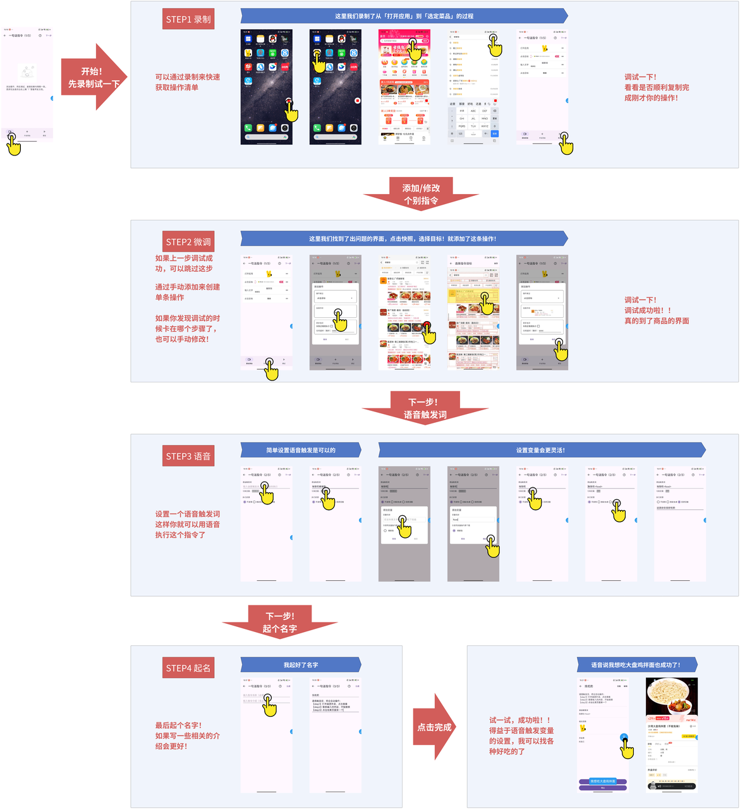

# Shortcuts for Android (SFA)  
为安卓设备打造快捷指令，用语音实现自动化操作！  

**Shortcuts for Android**（简称 **SFA**）是一款功能强大的工具，能够在安卓系统中实现类似 iOS 快捷指令的功能。通过语音，轻松解锁更多便捷操作！  

---

## 🚀 快速开始  
借助 SFA，你可以轻松创建属于自己的快捷指令。以下是几个功能示例：  

- **语音自动化操作**：语音执行一套自动化操作流程，例如听歌、播放番剧、导航等。  
- **语音发送消息**：通过语音向 QQ 的某位联系人发送消息。  
- **语音完成任务**：语音打车、购物等一气呵成。  

---

## 🛠️ 如何创建快捷指令？  

只需 3-4 个简单步骤，即可完成快捷指令的创建：  

---

## 🎥 教程视频  

想快速上手？跟着视频一步步学习，创建属于你的快捷指令！  
[教程视频](https://www.bilibili.com/video/BV1KeFcezEE9/?vd_source=531e73dc1ab2aff6ab3074357703fe9e)

---

## ✨ 项目亮点  

- **语音快捷指令**：量身定制，用语音解锁更高效的操作方式。  
- **操作简单**：支持录制操作或手动添加，轻松创建专属指令。  
- **高效自动化**：优化日常繁琐操作，节省时间，提高效率。  

---

## 📦 安装指南  

1. **下载** Shortcuts for Android 安装包：  
   - [GitHub Releases](https://github.com/carlliuxx/shortcuts_for_android/releases)  
   - [蓝奏云下载链接](https://wwsc.lanzouo.com/s/assistant)  
2. 按提示完成安装。  
3. 开始创造你的快捷指令，解锁全新操作体验！  

---

## ✅ 测试功能场景  

以下是本人已测试的功能场景，欢迎提交反馈！  

> **提示**：成功率优先级排序为：软件版本 > 弹窗情况 > 系统版本。如果执行失败，请优先确认使用推荐版本，或参考教程对快捷指令进行调整。

|          | **手机型号**     | **系统版本**        | **版本**   | **执行命令**                                | **是否成功** |
| -------- | ------------ | --------------- | -------- | --------------------------------------- | -------- |
| QQ       | Redmi Turbo3 | 1.0.16.0UNPCNXM | 9.1.35   | QQ发送\<message>给\<name> eg. QQ发送你好吗给张伟    | √        |
| 飞书       |              |                 | 7.35.6   | 发飞书消息\<message>给\<name> eg. 发飞书消息去吃饭给划水群 | √        |
| 滴滴打车     |              |                 | 7.0.0    | 我想打车去\<place> eg. 我想打车去动物园               | √        |
| 京东       |              |                 | 15.0.10  | 京东购买\<goods> eg. 京东购买手表                  | √        |
| 百度地图     |              |                 | 20.14.30 | 导航到\<place> eg. 导航到北京邮电大学                | √        |
| bilibili |              |                 | 8.31.0   | 在B站播放\<drama> eg. 在B站播放命运冠位指定            | √        |
| QQ音乐     |              |                 | 14.1.0.8 | 我想听\<sing> eg. 我想听青花瓷                    | √        |
| QQ音乐     |              |                 | 14.1.0.8 | QQ音乐每日推荐                                | √        |
| 汽水音乐     |              |                 | 13.4.0   | 播放音乐\<song> eg. 播放音乐青花瓷                  | √        |
| 汽水音乐     |              |                 | 13.4.0   | 听我喜欢的音乐                                 | √        |
| 网易云音乐    |              |                 | 9.2.45   | 播放我的收藏歌单                                | √        |
| 酷我音乐     |              |                 | 11.1.4.0 | 帮我播放\<song> eg. 帮我播放青花瓷                  | √        |
| 懒人听书     |              |                 | 8.5.4    | 我想听书\<story> eg. 我想听书三国演义                | √        |
| 直播吧      |              |                 | 6.8.8    | 我要看\<team>最近的赛事 eg. 我要看曼联最近的赛事           | √        |
| 河马剧场     |              |                 | 1.17.6   | 播放短剧\<playlet> eg. 播放短剧打工奇遇              | √        |
| 知乎       |              |                 | 10.39.0  | 打开知乎热榜                                  | √        |
| 同花顺      |              |                 | 11.21.02 | 查一下\<company>的股票 eg. 查一下京东的股票            | √        |
| 锤子便签     |              |                 | 4.1.7    | 记录一下\<tips> eg. 记录一下今天发版啦                | √        |

---

## 🙋‍♂️ 联系我  

如果你有任何问题，或者想分享你的想法和创意，可以加入以下交流平台：  

- 🐧 **QQ群**：789106774  

---

期待你的加入，一起让安卓设备变得更加智能高效！🎉  
